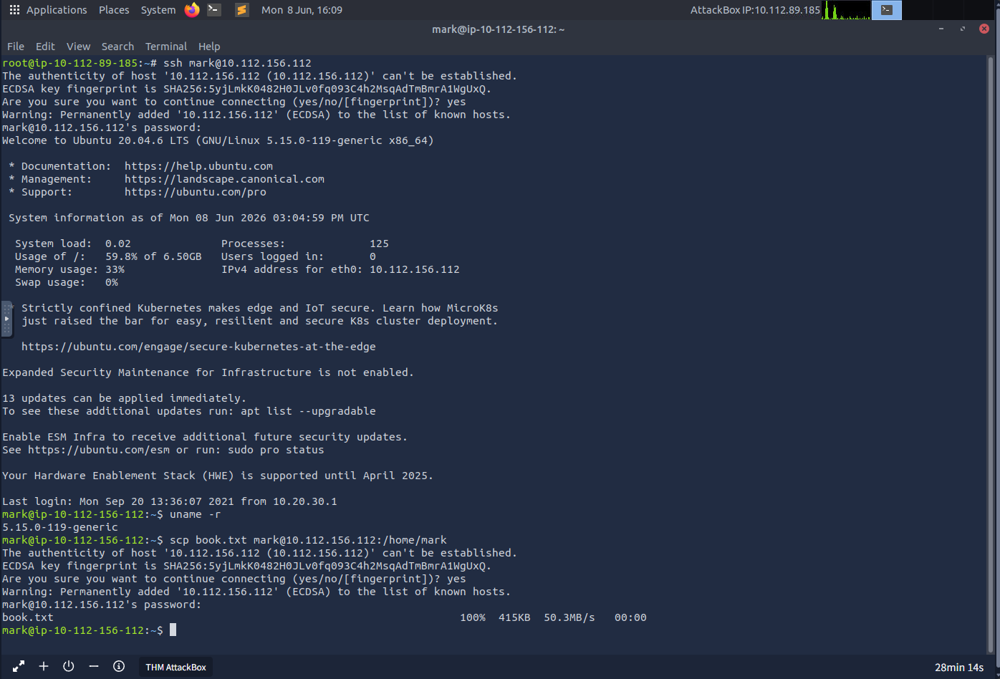

**Sniffing attack** = using packet capture tools to intercept data in transit, if in cleartext, it can reveal private messages, passwords...

Tcpdump (CLI), Wireshark (GUI), Tshark (CLI)

commands learned = sudo (root privileges) tcpdump port 110 (pop3) -A (ASCII format)

sudo tcpdump host 10.20.30.148 -A (capture from a specific host)

Mitigation = using TLS, network segmentation, VLANs, zero trust architecture

-------------------------------

**Man in the middle** = occurs when the victim believes they're communicating with a trusted destination, but the attacker in the middle of the conversation changes the message and the 

destination acts on it

How it works:

ARP spoofing = the attacker sends forged ARP requests to associate their MAC address to the ip of the default gateway, to redirect traffic his way

DNS spoofing = providing false DNS responses to redirect to the attacker's servers

Rogue Access Points = fake access points named on purpose to attract victims into connecting to them (free wifi)

Real life tools:

Bettercap

Ettercap

mitmproxy

Responder

Against encrypted traffic = SSL stripping, fake certificate

--------------------------------------------

**TLS**

TLS 1.3 (2018) current standard

HTTP	80	HTTPS	443

FTP	21	FTPS	990

SMTP	25	SMTPS	465

POP3	110	POP3S	995

IMAP	143	IMAPS	993

TLS handshake=

Clienthello: client sends a message

Serverhello: server responds with its parameters and certificate

Key exchange: they exchange information to generate the shared key

Finished: both sides onfirm

-----------------------------------

**SSH**  allows to securely connect to another system and execute remote commands

commands learned = 

ssh mark@10.112.156.112

ssh-keygen -t ed25519 -C "your_email@example.com" (generate keys)

**SIMULATION**

Goal : connecting to a given host with given credential and answering the question through commands

